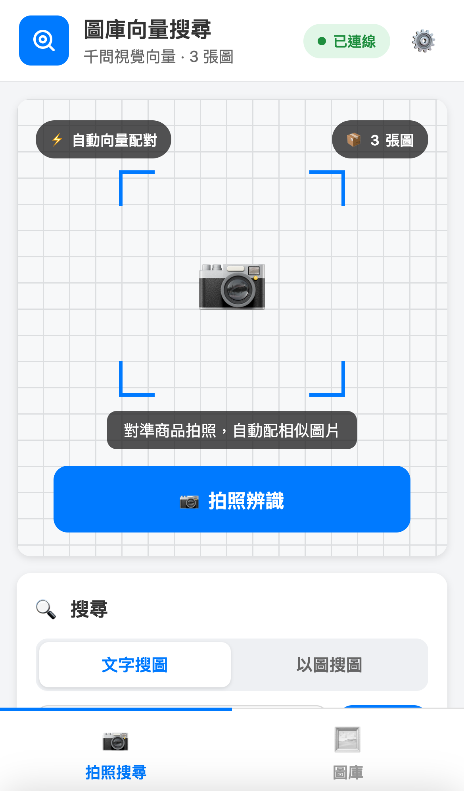
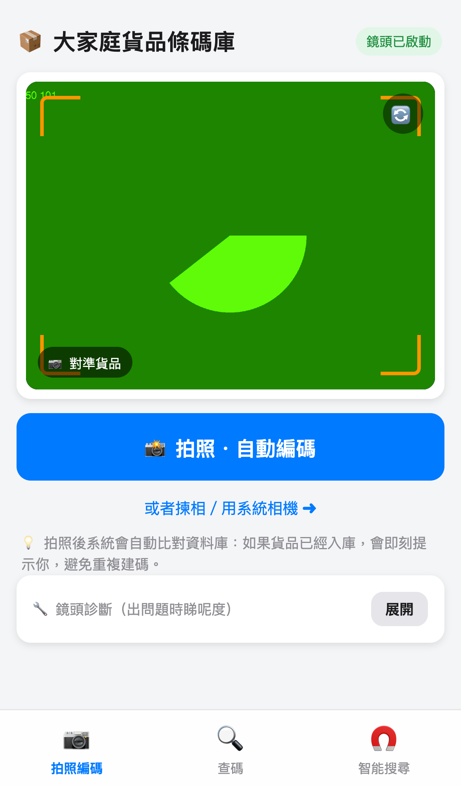
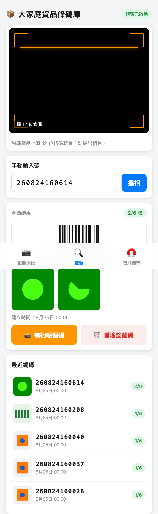

# 🏭 Warehouse Image Search

倉庫散貨掃碼搜尋 WebApp — 用 AI 圖片向量搜尋快速定位貨品

## 功能

- 📸 **拍照搜尋**：對準貨品拍照，AI 自動比對資料庫找出貨品碼
- 🔍 **條碼掃描**：鏡頭對準 12 位條碼，立即顯示相片與資料
- 🤖 **AI 粗估尺寸**：方格紙上拍照，自動估算貨品尺寸
- 📦 **同款多尺寸**：外貌一樣但尺寸不同的貨物，一次建立多個碼
- 💾 **軟刪除**：刪除可還原，不怕手滑
- 🔄 **防重複**：自動檢測重複入庫，避免重複建碼

## 技術架構

- **Runtime**: Cloudflare Workers
- **儲存**: Cloudflare R2（圖片儲存）
- **向量搜尋**: Cloudflare Vectorize
- **AI 模型**: 
  - `tongyi-embedding-vision-flash` — 圖片向量化
  - `qwen-vl-max` — 視覺理解

## 部署

```bash
# 安裝依賴
npm install

# 本地開發
npx wrangler dev

# 部署到 Cloudflare
npx wrangler deploy
```

## 使用方法

1. 用手機掃描 QR Code 或輸入網址
2. 允許鏡頭權限
3. 選擇功能：
   - 🧲 智能搜尋：拍照或輸入名稱搜尋
   - 📷 拍照編碼：為新貨品拍照入庫
   - 🔍 查碼：掃描條碼或輸入碼查詢

## 截圖

| 智能搜尋 | 拍照編碼 | 查碼結果 |
|---------|---------|---------|
|  |  |  |

## License

MIT
